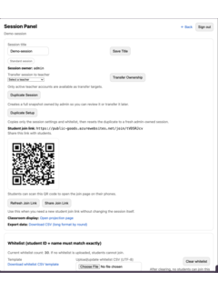
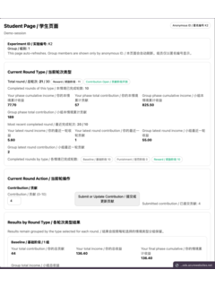
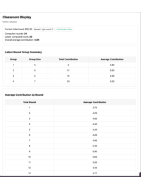
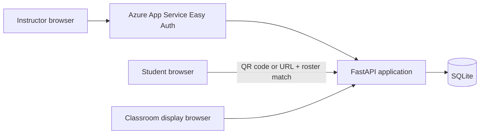

# Public Goods Classroom Experiment

A web application for running [public-goods experiments](https://en.wikipedia.org/wiki/Public_goods_game) in a classroom setting.

In a public-goods experiment, participants decide how many tokens to contribute to a shared pool. The group's contributions affect each participant's outcome, providing a basis for discussing cooperation and incentives. The application supports multiple rounds, some of which allow students to reward or punish other group members.

Students participate from their phones or laptops. Instructors manage sessions, show results to the class, and export the data for analysis. The application was developed for university teaching and is deployed at [public-goods.azurewebsites.net](https://public-goods.azurewebsites.net/). Instructor pages require an approved Microsoft account, and students need a session join link.

## Screenshots

These screenshots show a demo session with sample data. Select an image to view it at full size.

|                                                                                      Session panel                                                                                      |                                                                                 Student page                                                                                 |                                                                                             Classroom display                                                                                              |
| :-------------------------------------------------------------------------------------------------------------------------------------------------------------------------------------: | :--------------------------------------------------------------------------------------------------------------------------------------------------------------------------: | :--------------------------------------------------------------------------------------------------------------------------------------------------------------------------------------------------------: |
| <a href="docs/assets/session-panel.png"></a> | <a href="docs/assets/student-page.png"></a> | <a href="docs/assets/classroom-display.png"></a> |
|                                                         Share a QR code or URL, manage the student roster, and export results.                                                          |                                                       Submit a contribution and follow individual and group outcomes.                                                        |                                                                  Compare group contributions and follow the class average across rounds.                                                                   |

## How it works

1. An instructor creates a session, uploads a student roster, and shares its QR code or join URL.
2. Students join using a roster-matched student number and name. The instructor assigns them to groups and opens a round.
3. Students submit contributions. Reward and punishment rounds add a separate action stage before results are calculated.
4. The instructor projects the classroom display and exports a CSV after the experiment.

See the [classroom workflow](docs/classroom-guide.md) for the full sequence of controls and rules.

## Features

- Session creation, student rosters, group assignment, and instructor ownership.
- Baseline, reward, and punishment rounds with server-side validation of contributions and action budgets.
- Individual, group, and classroom views of contributions and results.
- CSV export with one row per student per round.
- Microsoft sign-in for approved instructors; students join through a session link and roster match.

## Getting started

Requires Python 3.11 or 3.12 and [uv](https://docs.astral.sh/uv/). From the repository root:

```bash
uv sync
cp .env.example .env
./scripts/dev.sh
```

Open `http://127.0.0.1:8000/admin` and sign in as `admin` with `local-dev-password` for a new local database. Local development uses password mode because Azure App Service authentication is not available when running the app directly. See [local development](docs/development.md) for configuration details.

## Technical details

The application uses FastAPI, Jinja2, JavaScript, and SQLite. Docker packages it for Azure App Service; GitHub Actions builds the image, publishes it to GitHub Container Registry, and deploys it.



Classroom submissions can arrive in bursts. SQLite runs in WAL mode with a busy timeout and bounded retries for locked writes. The deployment is designed for one App Service instance; SQLite still allows only one writer at a time. A [live smoke-test utility](scripts/live_smoke_test.py) can exercise concurrent student submissions.

## Testing

```bash
./scripts/check.sh
```

This runs pytest and checks the Jinja templates with djlint. The tests cover experiment calculations, authentication, authorization, session flows, and exports. GitHub Actions runs the checks on pull requests and before the container build and deployment on `main`.

## Documentation

- [Classroom workflow](docs/classroom-guide.md): detailed instructor and student flow.
- [Authentication and identity](docs/authentication.md): Microsoft sign-in, roles, migration, and Easy Auth setup.
- [Azure deployment](docs/deployment.md): container build, GitHub Actions, and setup scripts.
- [Operations and database](docs/operations.md): SQLite settings, live smoke testing, and backups.
- [Local development](docs/development.md): environment settings, development server, and checks.

## Known limitations

- SQLite is suited to the documented single-instance deployment, but concurrent writes remain limited to one writer.
- A join link and roster match do not provide strong individual student authentication.
- CSV exports and database backups can contain student identifiers and require appropriate handling.
